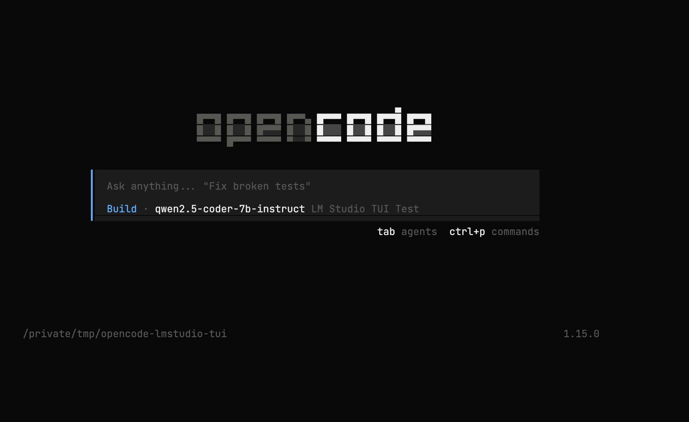
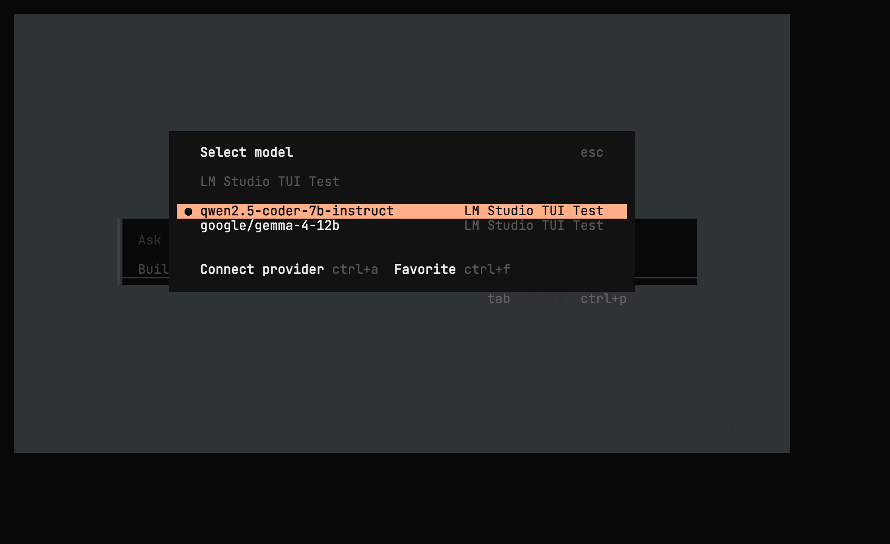
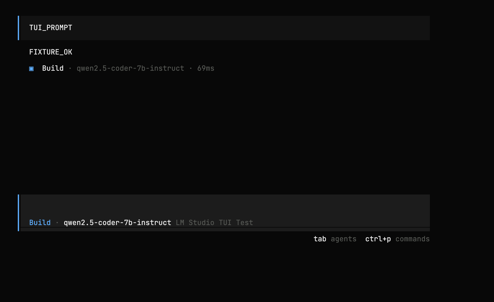

# opencode-lmstudio

Connect OpenCode to LM Studio with automatic, typed model discovery.

The plugin reads LM Studio's model metadata, configures OpenCode's `lmstudio`
provider, and builds the model list from the server available when OpenCode
starts.

> **v1 release candidate:** typed metadata discovery is available in
> `1.0.0-rc.1`. Stable npm `latest` remains on `0.3.1` while the RC is tested.
> Follow rollout status and share feedback in
> [issue #34](https://github.com/agustif/opencode-lmstudio/issues/34).

## What it configures

At startup, the plugin:

1. connects to an explicitly configured LM Studio server or a valid local
   server on port `1234`, `8080`, or `11434`;
2. reads `GET /api/v0/models` and validates the response;
3. adds `llm` and `vlm` models to OpenCode's chat provider;
4. maps vision support and context limits from LM Studio metadata;
5. carries the configured provider URL and authentication into discovery; and
6. merges explicit model overrides and whitelists with discovered models.

Embedding models and unrecognized model domains stay outside the chat-model
list. Downloaded models remain eligible for LM Studio's on-demand loading.

## Requirements

- OpenCode compatible with `@opencode-ai/plugin` 1.17.x
- LM Studio 0.3.6 or newer with the server enabled
- LM Studio's `GET /api/v0/models` endpoint
- Node.js `22.22.2`, `24.15.0`, or a supported version from `26` onward; or
  Bun `1.3.5` or newer

## Choose a release channel

### Stable

Install the stable package:

```sh
npm install opencode-lmstudio@latest
# or
bun add opencode-lmstudio@latest
```

Pin it in `opencode.json`:

```json
{
  "$schema": "https://opencode.ai/config.json",
  "plugin": ["opencode-lmstudio@0.3.1"]
}
```

### v1 release candidate

Install the current prerelease channel:

```sh
npm install opencode-lmstudio@next
# or
bun add opencode-lmstudio@next
```

Use the exact version for reproducible testing and feedback:

```json
{
  "$schema": "https://opencode.ai/config.json",
  "plugin": ["opencode-lmstudio@1.0.0-rc.1"]
}
```

To return to stable, set the plugin entry to `opencode-lmstudio@0.3.1` and
restart OpenCode.

## Local LM Studio quick start

1. Enable the LM Studio server.
2. Add the exact plugin version to `opencode.json`.
3. Start OpenCode and select a discovered LM Studio model.

For a local server on a common port, the plugin creates
`provider.lmstudio` after validating LM Studio's metadata response.

## Custom servers and authentication

Configure the provider explicitly for custom ports, private-network servers,
reverse proxies, and authenticated endpoints:

```json
{
  "$schema": "https://opencode.ai/config.json",
  "plugin": ["opencode-lmstudio@1.0.0-rc.1"],
  "provider": {
    "lmstudio": {
      "npm": "@ai-sdk/openai-compatible",
      "name": "LM Studio",
      "options": {
        "baseURL": "http://127.0.0.1:1234/v1",
        "apiKey": "{env:LMSTUDIO_API_KEY}"
      }
    }
  }
}
```

Discovery uses the same server and Bearer-token boundary as the OpenCode
provider. Supported token sources are:

- `provider.lmstudio.options.apiKey`, including OpenCode's `{env:NAME}` syntax;
- `LMSTUDIO_API_KEY` for local and private-network servers; and
- `LM_API_TOKEN` for local and private-network servers.

Public hosts use an explicit provider `apiKey` so credential routing stays
visible in configuration.

## Model behavior

### Model types

- `llm` models receive text input/output metadata.
- `vlm` models receive text and image input metadata plus attachment support.
- `embeddings` models remain available to LM Studio clients but are omitted
  from OpenCode's chat provider.

### Context limits

When LM Studio reports `max_context_length`, the plugin sets OpenCode's context
limit and reserves up to 8,192 tokens for output. Models without a reported
context length remain available without a generated limit.

### Overrides and whitelists

Explicit model configuration takes precedence over discovered metadata:

```json
{
  "provider": {
    "lmstudio": {
      "models": {
        "publisher/model-id": {
          "name": "My local model",
          "limit": {
            "context": 32768,
            "output": 8192
          }
        }
      },
      "whitelist": ["publisher/model-id"]
    }
  }
}
```

With no explicit whitelist, the plugin builds one from the discovered `llm`
and `vlm` model IDs.

## Troubleshooting

Validate a configuration with OpenCode's parser:

```sh
npm run validate:config -- /path/to/opencode.json
# or
OPENCODE_CONFIG=/path/to/opencode.json opencode debug config
```

OpenCode logs discovery events under the service name `opencode-lmstudio`.
See [DEBUG.md](./DEBUG.md) for endpoint checks, log levels, and repository
verification commands.

## OpenCode screenshots

These are Chromium screenshots of browser xterm.js replaying the raw ANSI
traces from the real OpenCode TUI. The PTY, interactions, assertions, and traces
come from Microsoft's `@microsoft/tui-test`; the images use xterm.js's browser
renderer instead of reconstructing terminal cells.







The durable TUI suite also captures the
[filtered vision-model search](./docs/screenshots/opencode-model-search.png) and
[selected-model home state](./docs/screenshots/opencode-selected-model.png).

Refresh the fixture and screenshots when the UI contract changes:

```sh
npm run fixture:capture
npm run test:tui:update
```

Use `npm run fixture:capture:api` when an LM Studio server is already running.
Captured fixtures omit local paths, sizes, and variant metadata.

## Development

```sh
npm install
npm run validate
npm run test:coverage
npm run smoke:opencode
npm run test:tui
npm pack --dry-run
```

`smoke:opencode` starts a local LM Studio fixture server and exercises plugin
loading, discovery, authentication, model selection, and a chat request through
the installed OpenCode CLI.

`test:tui` runs the installed OpenCode TUI in a real PTY, checks the selected
model, provider, model picker, filtered selection, and streamed chat surfaces.
It records raw ANSI traces in `tui-traces/` and renders browser xterm.js PNGs to
`.tui-test/screenshots/`. `test:tui:update` refreshes the checked-in README
images. `test:tui:package` runs the same view matrix from an installed
exact-version package or tarball and writes its images to `tui-artifacts/`.

`npm run release` runs the read-only release preflight. Release channels,
trusted publishing, and post-release verification are documented in
[RELEASE.md](./RELEASE.md).

## License

MIT
