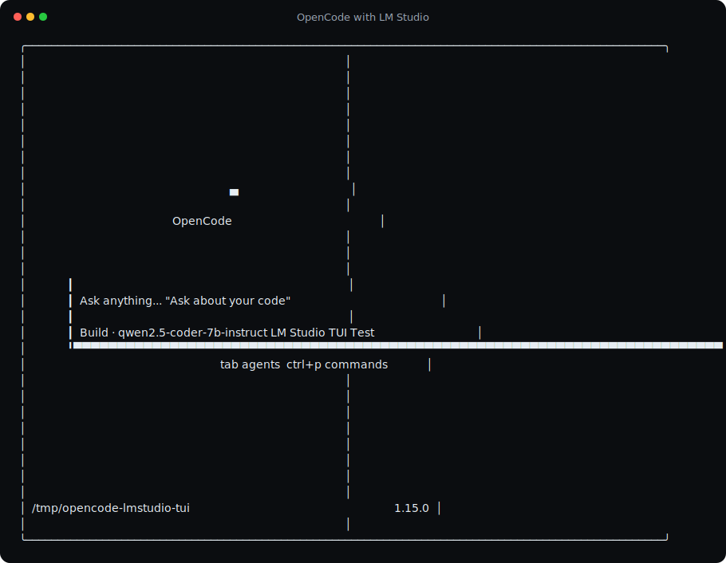
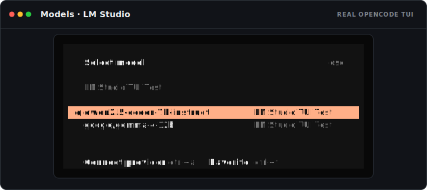

# opencode-lmstudio

Typed LM Studio model discovery for OpenCode.

The plugin enriches OpenCode's `lmstudio` provider from LM Studio's official
`GET /api/v0/models` metadata. It does **not** infer model type or capabilities
from model names.

## Features

- **Contract-based model discovery** through LM Studio's metadata-rich REST API
- **No model-name heuristics** or hard-coded model-family registries
- **Safe auto-detection** on the historical ports `1234`, `8080`, and `11434`;
  a port is accepted only when its `/api/v0/models` response validates
- **API key authentication** from provider configuration, `{env:NAME}` syntax,
  or the private-network-only `LMSTUDIO_API_KEY` / `LM_API_TOKEN` fallback
- **Embedding filtering** based on LM Studio's explicit `type` field
- **Vision metadata** for models explicitly reported as `vlm`
- **Context limits** from `max_context_length` when LM Studio reports it, with
  a bounded output reserve that keeps OpenCode compaction usable
- **Discovered-model whitelist** while preserving an explicit user whitelist
- **User override preservation**: configured model entries win over discovery
- **Structured OpenCode logging** through `client.app.log`
- **JIT loading compatibility**: no pre-request loaded-model checks block LM
  Studio from loading a downloaded model on demand

## Requirements

- A current OpenCode release compatible with `@opencode-ai/plugin` 1.17.x
- LM Studio 0.3.6 or newer with the local server enabled
- Node.js compatible with the package dependency graph

LM Studio documents `/api/v0/models` as a beta REST endpoint. It is used because
it reports `type`, `state`, and `max_context_length`. The OpenAI-compatible
`/v1/models` endpoint does not report enough metadata to distinguish chat,
vision, and embedding models safely, so this plugin intentionally does not use
it as a discovery fallback.

## Installation

Stable users should remain on `0.3.1`, which is published under npm's `latest`
dist-tag:

```sh
npm install opencode-lmstudio@latest
# or
bun add opencode-lmstudio@latest
```

Pin a released version in `opencode.json` so OpenCode does not reuse a stale
`@latest` plugin cache:

```json
{
  "$schema": "https://opencode.ai/config.json",
  "plugin": ["opencode-lmstudio@0.3.1"]
}
```

### Opt into the v1 release candidate

The typed discovery integration documented below is rolling out as
`1.0.0-rc.1`. Follow the live status and report results in
[#34](https://github.com/agustif/opencode-lmstudio/issues/34). Once the tracker
marks the RC as published, install the moving prerelease channel with:

```sh
npm install opencode-lmstudio@next
# or
bun add opencode-lmstudio@next
```

For reproducible testing, pin the exact candidate in `opencode.json`:

```json
{
  "$schema": "https://opencode.ai/config.json",
  "plugin": ["opencode-lmstudio@1.0.0-rc.1"]
}
```

The RC does not replace npm `latest`. To roll back, restore
`opencode-lmstudio@0.3.1` and restart OpenCode.

When no provider is configured, the plugin probes the historical local ports
and creates `provider.lmstudio` only after receiving a valid LM Studio response.

## Explicit provider configuration

Explicit configuration is recommended for remote servers, custom ports, and
servers requiring authentication:

```json
{
  "$schema": "https://opencode.ai/config.json",
  "plugin": ["opencode-lmstudio@1.0.0-rc.1"],
  "provider": {
    "lmstudio": {
      "npm": "@ai-sdk/openai-compatible",
      "name": "LM Studio",
      "options": {
        "baseURL": "http://127.0.0.1:1234/v1",
        "apiKey": "{env:LMSTUDIO_API_KEY}"
      }
    }
  }
}
```

The plugin removes a trailing `/v1` only when calling LM Studio's metadata API,
then keeps `/v1` on the OpenCode provider URL.

### Model overrides

Discovered metadata is merged before explicit model configuration, so user
values take precedence:

```json
{
  "provider": {
    "lmstudio": {
      "models": {
        "publisher/model-id": {
          "name": "My local model",
          "limit": {
            "context": 32768,
            "output": 8192
          }
        }
      }
    }
  }
}
```

An explicit `whitelist` is also preserved. Otherwise, the plugin creates one
from discovered non-embedding model IDs.

## Automated OpenCode screenshots

The checked-in screenshots below are generated by the real OpenCode TUI running
under Microsoft's `@microsoft/tui-test`. The TUI talks over HTTP to a sanitized,
recorded LM Studio `/api/v0/models` fixture captured from a local installation.
CI uses the checked-in fixture, so screenshots and assertions remain repeatable.





Refresh the sanitized model fixture and generated screenshots when needed:

```sh
npm run fixture:capture
npm run test:tui:update
```

Use `npm run fixture:capture:api` when a real LM Studio server is already
running. The capture script removes local paths, sizes, and variant metadata.

## Design decisions

### Why the REST API instead of `@lmstudio/sdk`?

The official SDK is strongly typed, but it connects over `ws`/`wss` and uses an
SDK-specific client authentication channel. OpenCode's provider is configured
for the HTTP server and its Bearer token. Using the official REST contract keeps
model discovery on the same endpoint, reverse-proxy path, and authentication
boundary as OpenCode requests while runtime validation supplies the TypeScript
boundary.

### Why embedding models are omitted

OpenCode's chat-model configuration accepts text, audio, image, video, and PDF
modalities; it has no embedding output modality. Registering an embedding model
as a chat model can fail config validation or fail at request time. Embeddings
are therefore skipped from this chat provider based only on LM Studio's explicit
`type: "embeddings"` metadata.

### Why no loaded-model guard exists

LM Studio can JIT-load downloaded models. Rejecting a request because a model is
not already loaded prevents that supported flow. Discovery runs during config
loading; OpenCode and LM Studio own request execution, retries, and JIT loading.

## Validation and troubleshooting

Run the complete repository validation:

```sh
npm run validate
```

Validate an OpenCode configuration with OpenCode's own parser:

```sh
npm run validate:config -- /path/to/opencode.json
```

Or inspect the resolved configuration directly:

```sh
OPENCODE_CONFIG=/path/to/opencode.json opencode debug config
```

If discovery fails for an explicitly configured provider, the plugin leaves the
existing configuration intact and writes a structured warning through OpenCode.
When no provider is configured and no local LM Studio server is found, it logs a
debug event and makes no configuration changes.

## Development

```sh
npm install
npm run validate
npm run test:coverage
npm run smoke:opencode
npm run test:tui
npm pack --dry-run
```

`smoke:opencode` starts an isolated mock LM Studio HTTP server and runs the real
installed `opencode` binary through config resolution and a chat request. It
verifies plugin loading, typed discovery, embedding filtering, vision metadata,
Bearer authentication, and OpenAI-compatible request routing.

`test:tui` uses Microsoft's `@microsoft/tui-test` with a real PTY and headless
xterm renderer. It starts the real installed OpenCode TUI against an isolated
LM Studio fixture and auto-waits for the prompt, selected model, and provider
label. Traces are recorded in the ignored `tui-traces/` directory for replay.
The TUI screenshot lane uses the compatibility version pinned in
`.opencode-tui-version`; the separate CLI smoke lane tests the current version
pinned in `.opencode-version`.

`npm run release` is deliberately a preflight-only command. It validates, audits,
and previews the package but never changes versions, commits, tags, pushes,
creates a GitHub release, or publishes npm. See [RELEASE.md](./RELEASE.md).

## License

MIT
